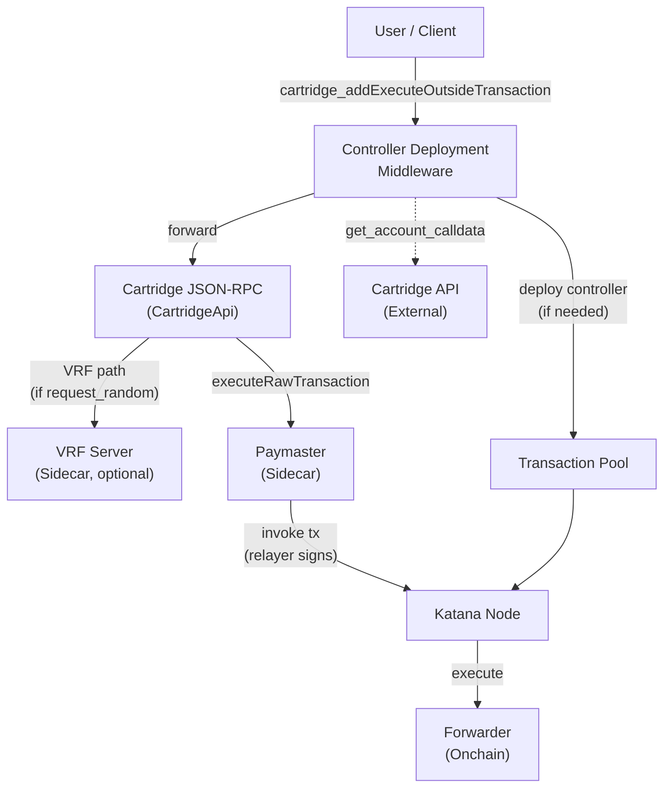
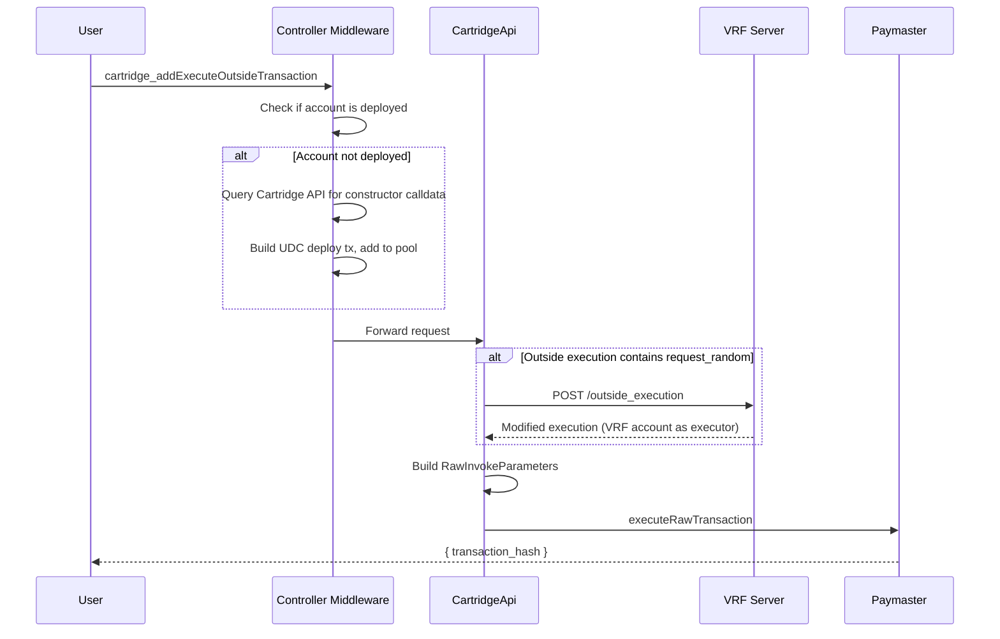
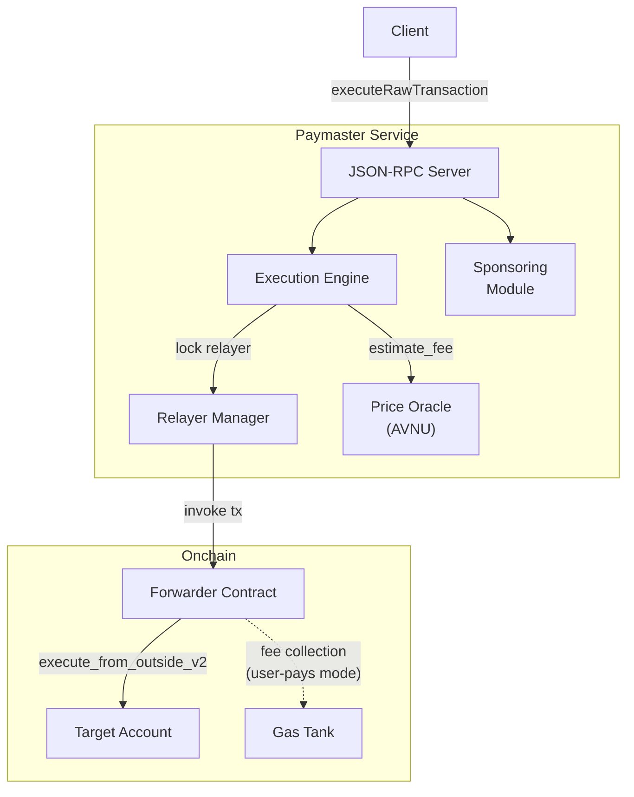

# Cartridge Integration

Katana integrates with the [Cartridge](https://cartridge.gg) ecosystem to provide a complete local development experience for applications that use Cartridge Controller accounts, paymaster-sponsored transactions, and verifiable randomness (VRF).

Key capabilities:

- **Controller account auto-deployment** -- Cartridge Controller accounts are deployed on-demand when first used, with full class hash versioning
- **Paymaster-sponsored transactions** -- gas fees are paid by a relayer via the AVNU paymaster, enabling gasless UX
- **Outside execution (SNIP-9)** -- users sign off-chain messages; a relayer submits and pays for the actual transaction
- **VRF integration** -- verifiable randomness (see [docs/vrf.md](vrf.md))

## Architecture



| Component | Location | Role |
|-----------|----------|------|
| **CartridgeApi** | `crates/rpc/rpc-server/src/cartridge/mod.rs` | RPC handler for outside execution; builds paymaster requests |
| **ControllerDeploymentLayer** | `crates/rpc/rpc-server/src/middleware/cartridge.rs` | Tower middleware; auto-deploys controllers on fee estimation and outside execution |
| **PaymasterProxy** | Proxied via `jsonrpsee` HTTP client | Forwards `paymaster_*` RPC methods to the upstream paymaster sidecar |
| **Cartridge API Client** | `crates/cartridge/src/api.rs` | HTTP client for interacting with Cartridge API `api.cartridge.gg` |
| **VRF Service** | `crates/rpc/rpc-server/src/cartridge/vrf.rs` | Delegates VRF proof generation to the VRF sidecar (see [docs/vrf.md](vrf.md)) |

## JSON-RPC API

The Cartridge namespace exposes two RPC methods (both have identical behavior):

### `cartridge_addExecuteOutsideTransaction`

Submits an outside execution request. The transaction is forwarded to the paymaster for sponsored execution.

**Parameters:**

| Name | Type | Description |
|------|------|-------------|
| `address` | `ContractAddress` | The user's account address |
| `outside_execution` | `OutsideExecution` | The execution payload (V2 or V3) |
| `signature` | `Vec<Felt>` | Signature over the outside execution |
| `fee_source` | `Option<FeeSource>` | How fees are paid (default: sponsored) |

**Returns:** `{ "transaction_hash": "0x..." }`

### `cartridge_addExecuteFromOutside`

Alias for `cartridge_addExecuteOutsideTransaction` with identical parameters and behavior.

### FeeSource

```json
"Paymaster"  // Sponsored by the paymaster relayer (default)
"Credits"    // Paid from user's STRK balance
```

| Value | Behavior |
|-------|----------|
| `"Paymaster"` or `null` | `FeeMode::Sponsored` -- relayer pays gas |
| `"Credits"` | `FeeMode::Default` with STRK gas token -- user pays |

> Source: `crates/rpc/rpc-types/src/cartridge.rs`

## Outside execution types

Based on [SNIP-9](https://github.com/starknet-io/SNIPs/blob/main/SNIPS/snip-9.md). The `OutsideExecution` enum is untagged and automatically deserialized as V2 or V3 based on the nonce field shape.

### OutsideExecutionV2 (SNIP-9 standard)

| Field | Type | Description |
|-------|------|-------------|
| `caller` | `ContractAddress` | Address allowed to initiate execution (`0x414e595f43414c4c4552` for any caller) |
| `nonce` | `Felt` | Unique nonce to prevent signature reuse |
| `execute_after` | `u64` | Timestamp after which execution is valid |
| `execute_before` | `u64` | Timestamp before which execution is valid |
| `calls` | `Vec<Call>` | Calls to execute in order |

Maps to entry point `execute_from_outside_v2`.

### OutsideExecutionV3 (Cartridge Controller extended)

Same fields as V2 except the nonce is a `NonceChannel` (a tuple of `[Felt, u128]` representing channel and value). This is a non-standard extension supported by the Cartridge Controller.

Maps to entry point `execute_from_outside_v3`.

### Call JSON format

Calls are serialized with `to` and `selector` field names:

```json
{
  "to": "0x49d36570d4e46f48e99674bd3fcc84644ddd6b96f7c741b1562b82f9e004dc7",
  "selector": "0x83afd3f4caedc6eebf44246fe54e38c95e3179a5ec9ea81740eca5b482d12e",
  "calldata": ["0x...", "0x..."]
}
```

> Source: `crates/rpc/rpc-types/src/outside_execution.rs`

## Execute outside flow



### Processing steps

1. **Controller deployment check** (middleware): If the `address` is not deployed, query the Cartridge API. If it's a registered controller, craft a deploy transaction via UDC and add it to the transaction pool.

2. **VRF detection** (CartridgeApi): Scan the outside execution calls for a `request_random` selector. If found, validate it has a follow-up call and targets the VRF account, then delegate to the VRF server. The VRF server returns a modified execution with the VRF account as executor. See [docs/vrf.md](vrf.md) for details.

3. **Build paymaster request** (CartridgeApi): Construct `RawInvokeParameters` with:
   - `user_address`: the original address (or VRF account if VRF path)
   - `execute_from_outside_call`: the serialized outside execution call

4. **Forward to paymaster**: Call `paymaster_executeRawTransaction` with the fee mode derived from `fee_source`. The paymaster's relayer signs and submits the invoke transaction.

## Controller account auto-deployment

Cartridge Controller accounts are Starknet accounts managed by the Cartridge platform. They use versioned class hashes (V104 through latest) and are deployed via the Universal Deployer Contract (UDC) with the username as salt, ensuring deterministic addresses.

### ControllerDeploymentLayer

A Tower middleware that intercepts two RPC methods to ensure controllers are deployed before use:

#### `starknet_estimateFee` interception

1. Extract sender addresses from transactions in the estimate request
2. For each undeployed sender, query the Cartridge API for constructor calldata
3. If calldata found (address is a controller), build a deploy transaction
4. Prepend deploy transactions to the original estimate request
5. Forward the augmented request to the inner RPC service
6. Strip deploy transaction estimates from the response before returning

This ensures the estimate succeeds even for undeployed controllers, while returning only the estimates the caller asked for.

#### `cartridge_addExecuteOutsideTransaction` interception

1. Check if the `address` is already deployed
2. If not, query the Cartridge API for constructor calldata
3. If it's a controller, build a deploy transaction and add it to the transaction pool
4. Forward the original request to CartridgeApi

The deploy transaction is added to the pool separately; execution order is not guaranteed but typically processes before the outside execution.

### Cartridge API client

The client queries `POST /accounts/calldata` on the Cartridge API (default: `https://api.cartridge.gg`):

**Request:**
```json
{ "address": "0x..." }
```

**Response** (if registered controller):
```json
{
  "address": "0x...",
  "username": "player1",
  "calldata": ["0x...", "0x...", ...]
}
```

The `calldata` field contains UDC-ready constructor calldata (class hash + salt + constructor args). If the address is not a registered controller, the API returns `"Address not found"` and no deployment is attempted.

> Source: `crates/cartridge/src/api.rs`

### Deploy transaction structure

- **Sender**: configured deployer account (genesis account 0)
- **Target**: `DEFAULT_UDC_ADDRESS` with selector `deployContract`
- **Calldata**: constructor calldata from Cartridge API
- **Transaction type**: InvokeV3, signed by the deployer's private key

### Controller class versioning

When `--cartridge.controllers` is enabled, all known controller class versions (V104 through latest) are declared at genesis. This ensures that any version of the Cartridge Controller can be deployed locally, matching the address computation used in production.

## AVNU paymaster service

The AVNU paymaster is an external service that sponsors gas fees for user transactions. In Katana's local dev mode, it runs as a sidecar process. The paymaster source is at [cartridge-gg/paymaster](https://github.com/cartridge-gg/paymaster), pinned in `sidecar-versions.toml`.

### Architecture

The paymaster uses three dedicated genesis accounts, an onchain Forwarder contract, and a relayer management system:

| Account | Genesis Index | Role |
|---------|--------------|------|
| **Relayer** | 0 | Signs and submits invoke transactions; pays execution fees |
| **Gas Tank** | 1 | Receives collected fees from user-pays transactions |
| **Estimate Account** | 2 | Used by the paymaster for fee estimation (`simulate_transaction`) |



### Forwarder contract

The Forwarder ([`contracts/src/forwarder.cairo`](https://github.com/cartridge-gg/paymaster/blob/4748365/contracts/src/forwarder.cairo)) is the onchain entry point. It integrates ownable, upgradeable, and whitelist components.

| Function | Description |
|----------|-------------|
| `execute(calls, gas_amount, gas_token)` | Execute user calls, then transfer `gas_amount` of `gas_token` to the gas fees recipient (user-pays mode) |
| `execute_sponsored(calls, sponsor_metadata)` | Execute user calls without fee collection; emits `SponsoredTransaction` event (sponsored mode) |
| `set_whitelisted_address(address, enabled)` | Add/remove from the whitelist (owner-only) |
| `get_gas_fees_recipient()` | Returns the address that receives collected fees |

All `execute` calls verify the caller is whitelisted before processing. During bootstrap, the relayer, estimate account, and (when VRF is enabled) VRF account are all whitelisted automatically.

Deployed deterministically via UDC with salt `0x12345` and constructor args `[relayer_address, gas_tank_address]`.

### Transaction processing flow

When the paymaster receives an `executeRawTransaction` request:

1. **Validation**: Check service availability (at least one relayer enabled), verify API key if sponsored, run blacklist and token support checks
2. **Fee estimation**: Build a Starknet transaction, call `estimate_fee_v3()`, then apply fee multipliers:
   - `suggested_max_fee = base_fee * max_fee_multiplier`
   - `paid_fee = suggested_max_fee * (1 + provider_fee_overhead)`
   - Account-specific gas overhead added (e.g., Braavos accounts have extra validation gas)
3. **Relayer acquisition**: Lock an available relayer via the relayer manager (in-process or Redis-based locking)
4. **Execution**: Submit the invoke transaction via the locked relayer. On invalid nonce, retry up to 3 times with a fresh nonce. On success, increment the cached nonce and release the lock immediately. On nonce error, release the lock with a delay to allow resync.
5. **Response**: Return `{ transaction_hash, tracking_id }`

### Fee modes

| Mode | Who Pays | Forwarder Function | Token |
|------|----------|-------------------|-------|
| **Sponsored** | Relayer | `execute_sponsored()` | STRK (default) |
| **Default** | User | `execute()` | Any supported ERC-20 |

In **sponsored mode**, the paymaster validates the API key against its sponsoring module (self-hosted key check or external webhook). In **default mode**, the paymaster injects a token transfer call from the user to the forwarder to collect the fee.

### Relayer management

The paymaster supports multiple relayer accounts sharing a single private key. Relayers are locked exclusively for each transaction to prevent nonce conflicts.

**Locking modes:**

| Mode | Backend | Use Case |
|------|---------|----------|
| **Segregated** | In-process mutex | Single-instance deployments (Katana sidecar) |
| **Shared** | Redis | Multi-instance horizontal scaling |

Each relayer tracks its nonce in a local cache with TTL. When a lock is released after a nonce error, a cooldown period (default 5s) prevents immediate reuse, allowing the chain state to settle.

**Optional rebalancing**: A background service can automatically swap collected ERC-20 tokens to STRK via AVNU and redistribute STRK to relayers whose balance drops below a configurable threshold.

### Price oracle

Token prices are fetched from the AVNU Impulse API with a 60-second cache per token. This is used to convert STRK-denominated fees to the user's chosen gas token in default (user-pays) mode.

### Bootstrap

When running in sidecar mode, the paymaster is bootstrapped automatically:

1. Get chain ID from the Katana node
2. Declare the Avnu Forwarder class (if not already declared)
3. Deploy the Forwarder contract via UDC (deterministic address)
4. Whitelist the **relayer** and **estimate account** on the Forwarder (both need access: the relayer submits transactions, the estimate account is used for fee estimation via `simulate_transaction`)
5. If VRF is enabled, whitelist the **VRF account** on the Forwarder (the VRF account becomes the `user_address` in VRF transactions routed through the Forwarder)
6. Generate a paymaster profile JSON (accounts, tokens, chain config, price oracle settings)
7. Spawn the `paymaster-service` binary with the profile via `PAYMASTER_PROFILE` env var
8. Wait for health check (20s timeout)

| Constant | Value | Purpose |
|----------|-------|---------|
| `FORWARDER_SALT` | `0x12345` | UDC deployment salt for the Avnu Forwarder |
| `BOOTSTRAP_TIMEOUT` | 20s | Max wait time for bootstrap operations and sidecar readiness |

> Source: `crates/paymaster/src/lib.rs`

### Paymaster JSON-RPC API

Katana proxies the following `paymaster_*` RPC methods to the upstream paymaster service. Requests include the `x-paymaster-api-key` header when an API key is configured.

| Method | Return Type | Description |
|--------|-------------|-------------|
| `paymaster_health` | `bool` | Health check (liveness) |
| `paymaster_isAvailable` | `bool` | Whether at least one relayer is enabled and ready |
| `paymaster_buildTransaction` | `BuildTransactionResponse` | Build a transaction with fee estimates (without executing) |
| `paymaster_executeTransaction` | `ExecuteResponse` | Build, estimate, and execute in one call |
| `paymaster_executeRawTransaction` | `ExecuteRawResponse` | Execute a pre-built raw invoke (used by CartridgeApi) |
| `paymaster_getSupportedTokens` | `Vec<TokenPrice>` | List tokens with current STRK prices from AVNU oracle |

> Source: `crates/paymaster/src/api.rs`

### Integration with Cartridge API

The Cartridge RPC handler (`CartridgeApi`) uses the paymaster's `executeRawTransaction` method to submit outside execution requests:

1. **CartridgeApi** receives an outside execution request via `cartridge_addExecuteOutsideTransaction`
2. It serializes the outside execution into a `Call` (targeting the user's account with the appropriate `execute_from_outside_v2/v3` selector)
3. It builds `RawInvokeParameters`:
   - `user_address`: the account address (or VRF account if VRF path)
   - `execute_from_outside_call`: the serialized call
4. It selects the fee mode based on `FeeSource`:
   - `Paymaster` or `null` -> `FeeMode::Sponsored` (relayer pays, forwarder calls `execute_sponsored`)
   - `Credits` -> `FeeMode::Default` with STRK gas token (user pays, forwarder calls `execute` with fee collection)
5. Calls `paymaster_executeRawTransaction` with the request
6. The paymaster estimates fees, locks a relayer, builds an invoke transaction, and submits it
7. The relayer's invoke calls the Forwarder, which calls `execute_from_outside_v2` on the target account

## Configuration

### Paymaster CLI flags

| Flag | Type | Default | Description |
|------|------|---------|-------------|
| `--paymaster` | bool | `false` | Enable paymaster service |
| `--paymaster.url` | URL | -- | Connect to external paymaster instead of sidecar |
| `--paymaster.api-key` | string | -- | API key for `x-paymaster-api-key` header (requires `--paymaster.url`) |
| `--paymaster.price-api-key` | string | -- | AVNU price oracle API key (sidecar mode only) |
| `--paymaster.bin` | path | `paymaster-service` | Path to paymaster sidecar binary |

### Cartridge CLI flags

| Flag | Type | Default | Description |
|------|------|---------|-------------|
| `--cartridge.controllers` | bool | `false` | Declare all Controller class versions at genesis |
| `--cartridge.paymaster` | bool | `false` | Enable Cartridge paymaster integration (requires `--paymaster`) |
| `--cartridge.api` | URL | `https://api.cartridge.gg` | Cartridge API base URL |

VRF flags are documented in [docs/vrf.md](vrf.md).

### Modes of operation

Both the paymaster and VRF services can run in **sidecar mode** (Katana manages the process) or **external mode** (user provides a remote URL). The behavior differs significantly between the two modes.

#### Paymaster

| | Sidecar mode | External mode |
|---|---|---|
| **Enabled by** | `--paymaster` (without `--paymaster.url`) | `--paymaster --paymaster.url <URL>` |
| **Bootstrap** | Katana declares the Avnu Forwarder class, deploys the Forwarder contract, whitelists the relayer, and generates a paymaster profile | None -- the external service is assumed to be fully configured |
| **Process management** | Katana spawns the `paymaster-service` binary as a child process and monitors its health | None -- Katana only proxies RPC requests to the given URL |
| **Credentials** | Derived automatically from genesis accounts (relayer = account 0, gas tank = account 1, estimate = account 2) | Not managed by Katana -- the external service manages its own accounts |
| **API key** | Auto-generated default (`paymaster_katana`); configurable via `--paymaster.api-key` | Must be provided via `--paymaster.api-key` if the external service requires authentication |
| **Chain ID** | Mapped from Katana's chain ID and written to the profile (see [Chain ID handling](#chain-id-handling)) | Not applicable -- the external service has its own chain ID configuration |
| **Forwarder** | Deployed and whitelisted during bootstrap | Must already exist on the target network |

#### VRF

| | Sidecar mode | External mode |
|---|---|---|
| **Enabled by** | `--vrf` (without `--vrf.url`) | `--vrf --vrf.url <URL> --vrf.contract <ADDRESS>` |
| **Bootstrap** | Katana declares and deploys the VRF account and consumer contracts, funds the VRF account, and sets the VRF public key | None -- the external VRF service and its onchain contracts are assumed to be already deployed |
| **Process management** | Katana spawns the `vrf-server` binary as a child process | None -- Katana sends HTTP requests to the given URL |
| **VRF account** | Address derived deterministically from hardcoded secret key and salt | Must be provided explicitly via `--vrf.contract` |
| **Credentials** | Derived from the hardcoded VRF secret key (`0x111`) | Not managed by Katana -- the external service manages its own keys |

In external mode, the user is fully responsible for deploying and configuring the service, its onchain contracts, and ensuring compatibility with Katana's chain ID and RPC endpoint. Katana does not perform any bootstrap or validation of the external service beyond basic health checks.

> Source: `crates/cli/src/args.rs`, `crates/cli/src/sidecar/mod.rs`

### Sidecar binary resolution

In sidecar mode, both `paymaster-service` and `vrf-server` binaries are resolved in order:

1. Explicit path via `--paymaster.bin` / `--vrf.bin`
2. Search in `$PATH`
3. Check `~/.katana/bin/`
4. Prompt for lazy download from the Katana GitHub release

Sidecar versions are pinned in `sidecar-versions.toml` at the repository root and are independent from the Katana version.

> Source: `crates/cli/src/sidecar/mod.rs`

## Distributed tracing

Katana and both sidecars (`paymaster-service`, `vrf-server`) emit OpenTelemetry spans via OTLP, so a single request that fans out from Katana through the sidecars produces one end-to-end trace in the collector.

### Wire protocol

| Service | Transport | Default endpoint |
|---------|-----------|------------------|
| `katana` | OTLP **gRPC** | `http://localhost:4317` |
| `vrf-server` | OTLP **gRPC** | `http://localhost:4317` |
| `paymaster-service` | OTLP **HTTP** | `http://localhost:4318/v1/traces` |

Context is propagated using the W3C **TraceContext** format (`traceparent` header). Any OTLP-compatible collector that accepts both gRPC and HTTP on the standard ports (Jaeger v2, `otel-collector`, Tempo, etc.) will stitch the three services under one `trace_id`.

### Enabling it

**Katana:**
```bash
katana --tracer.otlp --tracer.otlp-endpoint http://localhost:4317 ...
```

See [`--tracer.gcloud`](../README.md) for the Google Cloud Trace alternative, which uses the `X-Cloud-Trace-Context` propagator instead of W3C.

**vrf-server** (when running standalone or via `--vrf.bin`):
```bash
vrf-server --tracer.otlp --tracer.otlp-endpoint http://localhost:4317 ...
```

**paymaster-service** (configured via the profile JSON that katana writes in sidecar mode):
```json
{
  "prometheus": {
    "endpoint": "http://localhost:4318",
    "token": null
  }
}
```

> The profile field is named `prometheus` for historical reasons but actually configures OTLP trace and metric export. Setting it to `null` disables telemetry.

### What gets traced

| Service | Root span | Child spans |
|---------|-----------|-------------|
| `katana` | `http_request` (tower-http) | `rpc_call`, `db_get`, `db_put`, `db_txn_ro_create`, stage/pipeline spans |
| `paymaster-service` | `http_request` (tower-http) | `paymaster_health`, `paymaster_buildTransaction`, `paymaster_executeTransaction`, `paymaster_executeRawTransaction`, ... (from `#[instrument]` on each RPC method) |
| `vrf-server` | `http_request` (tower-http) | handler-level spans when `#[instrument]` is applied (not wired by default) |

Inbound `traceparent` headers are extracted by a `tower_http::TraceLayer` with a custom `MakeSpan` that calls the globally installed text-map propagator. Outbound HTTP calls between services (Katana -> paymaster, CartridgeApi -> vrf-server) do not yet inject `traceparent` automatically — callers that want full chain visibility must set the header themselves, or the service will start a fresh root span.

### End-to-end example

```bash
# Start an OTLP collector (Jaeger v2 shown here — UI on :16686):
jaeger --config file:/path/to/jaeger-config.yaml

# Start katana with OTLP tracing:
katana --chain-id SN_SEPOLIA \
       --paymaster --cartridge.paymaster --vrf \
       --tracer.otlp --tracer.otlp-endpoint http://localhost:4317

# Send a request with a synthesized W3C trace context:
curl http://localhost:5050 \
  -H 'traceparent: 00-0af7651916cd43dd8448eb211c80319c-b7ad6b7169203331-01' \
  -d '{"jsonrpc":"2.0","method":"cartridge_addExecuteOutsideTransaction","params":[...],"id":1}'

# All three services emit spans under trace_id 0af7651916cd43dd8448eb211c80319c.
```

> Source: `crates/tracing/src/otlp.rs`, `crates/tracing/src/gcloud.rs`; [cartridge-gg/vrf#46](https://github.com/cartridge-gg/vrf/pull/46), [cartridge-gg/paymaster#15](https://github.com/cartridge-gg/paymaster/pull/15)

## Error codes

| Code | Variant | Message |
|------|---------|---------|
| 200 | `ControllerDeployment` | Controller deployment failed |
| 201 | `VrfMissingFollowUpCall` | `request_random` call must be followed by another call |
| 202 | `VrfInvalidTarget` | `request_random` call must target the VRF account |
| 203 | `VrfExecutionFailed` | VRF execution failed: `{reason}` |
| 204 | `PaymasterExecutionFailed` | Paymaster execution failed: `{reason}` |
| 205 | `PoolError` | Transaction pool error: `{reason}` |
| 206 | `ProviderError` | Provider error: `{reason}` |
| 299 | `InternalError` | Internal error: `{reason}` |

> Source: `crates/rpc/rpc-api/src/error/cartridge.rs`

## Chain ID handling

The paymaster supports arbitrary Starknet chain IDs, including Katana's default `KATANA` (`0x4b4154414e41`) and custom appchain chain IDs. The configured chain ID felt is preserved as-is for transaction signing and EIP-712 domain separation, so signatures verify correctly regardless of the chain ID used.

For chain-derived defaults (USDC token address, AVNU swap endpoint, AVNU token metadata API, AVNU exchange address, Coingecko mapping, default RPC URL), the paymaster falls back to **Sepolia** values for any chain ID other than `SN_MAIN`. This means:

- **Signing / transaction hashing**: uses the actual chain ID — no mismatch, no signature failures.
- **Chain-specific service endpoints and token metadata**: resolve to Sepolia defaults unless the chain ID is `SN_MAIN`.

## Troubleshooting

### Chrome blocks requests from the Controller iframe to local Katana (Private Network Access)

The Cartridge Controller frontend is served as an iframe from a secure origin (e.g., `https://x.cartridge.gg`). When this iframe makes requests to a local Katana instance running on `localhost`, Chrome may block them due to [Private Network Access](https://developer.chrome.com/blog/private-network-access-update) (PNA) restrictions -- even if Katana is started with `--http.cors-origins "*"`.

PNA is a browser security feature that prevents public websites from making requests to private/local network addresses. Because the iframe origin is a public HTTPS site and Katana is on `localhost`, Chrome treats this as a public-to-private request and blocks it regardless of CORS headers.

**Workaround:** Disable Chrome's PNA checks for local development:

1. Open Chrome and navigate to `chrome://flags/#local-network-access-check`
2. Set **Local Network Access Checks** to **Disabled**
3. Relaunch Chrome when prompted

> This flag disables a security feature. Only use this workaround during local development and re-enable the setting when done.
