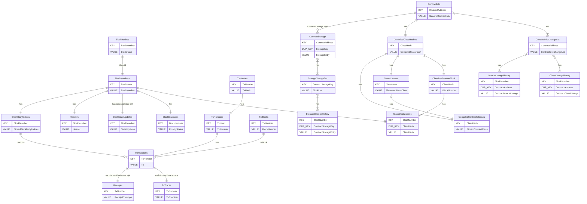

# Database

## Table layout

New receipt rows are stored as a receipt-specific envelope plus `zstd(postcard(receipt))`.
Legacy rows without that envelope remain readable and are decoded as raw postcard bytes for
backward compatibility.

## Envelope Header Convention

When a table value needs format evolution without a full migration, use an explicit envelope
header:

`[magic:4][version:1][encoding:1][payload...]`

The `magic` field convention for Katana DB envelopes is:

- 4-byte uppercase ASCII.
- First byte is `K` (Katana DB namespace).
- Remaining 3 bytes identify the payload family.

For receipts we use `KRCP` (`K` + `RCP`).

Reader behavior for envelope-enabled values:

- If magic matches, treat the row as enveloped and validate `version` + `encoding`.
- If magic does not match, treat the row as legacy format.
- If magic matches but metadata is unsupported/corrupt, return an error (do not fall back to
  legacy decoding).

`BlockStateUpdates` stores the canonical per-block state diff used by `StateUpdateProvider` and RPC `get_state_update`.

The `*ChangeHistory`, `*ChangeSet`, `ClassDeclarations`, and `MigratedCompiledClassHashes` tables are historical reconstruction data. They may be compacted by pruning and must not be treated as the canonical source of a block's exact state diff.
