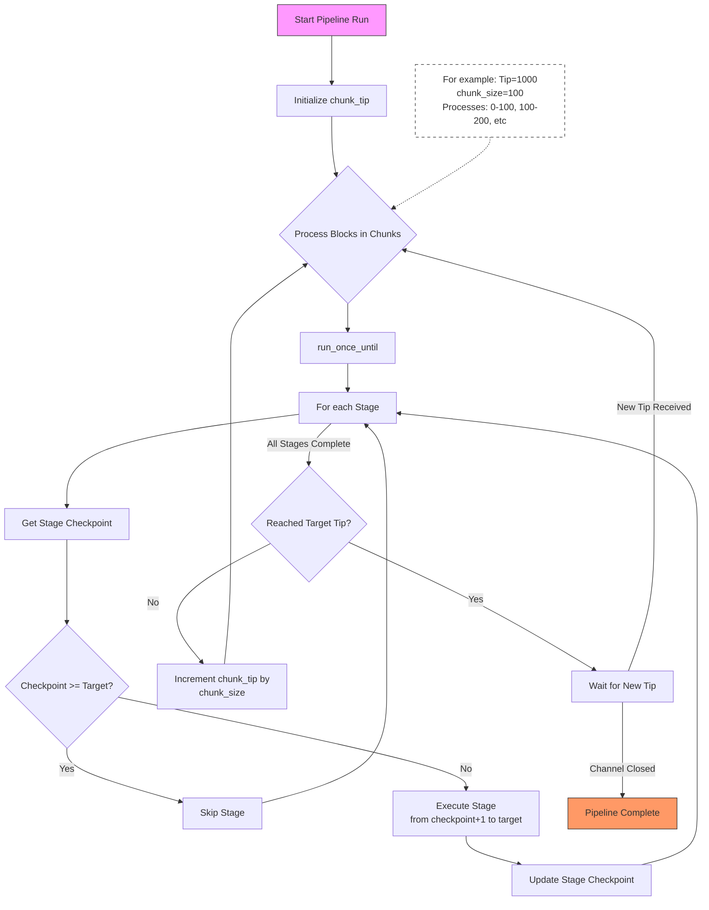

# Syncing pipeline

## Stages

The pipeline is composed of the following stages, executed in order for each chunk of blocks:

| Stage | ID | Description |
|-------|----|-------------|
| **Blocks** | `Blocks` | Downloads blocks from the sync source (JSON-RPC or gateway), validates chain invariants and block hashes, and stores block data (headers, hashes, body indices, canonical state updates, transactions, receipts, traces, class artifacts, declarations). Does **not** build historical state indices. |
| **Classes** | `Classes` | Downloads full class artifacts (Sierra / legacy) for any classes declared in the synced blocks that are not yet stored locally. |
| **IndexHistory** | `IndexHistory` | Reads the canonical `BlockStateUpdates` written by the Blocks stage and builds historical state indices: `ContractStorage`, `StorageChangeSet`, `StorageChangeHistory`, `ContractInfo`, `ContractInfoChangeSet`, `ClassChangeHistory`, `NonceChangeHistory`. Owns pruning of these indices. |
| **StateTrie** | `StateTrie` | Computes and validates state tries (contract, class, storage) for each block, verifying the computed state root matches the block header. Only runs when trie computation is enabled. |

> **Note:** The sequencing / block-production path and `ForkedProvider` use `insert_block_with_states_and_receipts`, which calls both `insert_block_data` and `insert_state_history` in a single transaction. The pipeline separates these into distinct stages so that each concern can be checkpointed and pruned independently.

## Pipeline flow

