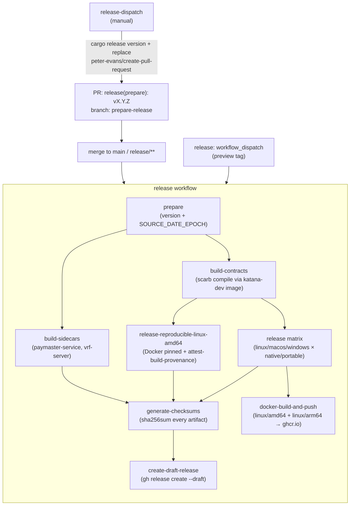

# Release pipeline

How a tagged Katana release is produced and published. The pipeline is two GitHub Actions workflows plus one supporting script, driven by `cargo-release` for version bookkeeping. End-to-end output is a draft GitHub release with platform binaries, sidecar binaries, a reproducible Linux amd64 build with build-provenance attestation, an aggregated `checksums.txt`, plus multi-arch container images on `ghcr.io`.

## Workflows at a glance

| Workflow | Path | Trigger | Purpose |
|----------|------|---------|---------|
| `release-dispatch` | [`.github/workflows/release-dispatch.yml`](../.github/workflows/release-dispatch.yml) | manual | Bumps the workspace version with `cargo release` and opens a `prepare-release` PR. |
| `release` | [`.github/workflows/release.yml`](../.github/workflows/release.yml) | merging the `prepare-release` PR, **or** manual dispatch (`preview` mode) | Builds + packages every artifact and creates the draft release. |

Companion script:

| Script | Path | Used by |
|--------|------|---------|
| `build-reproducible-katana.sh` | [`scripts/build-reproducible-katana.sh`](../scripts/build-reproducible-katana.sh) | `release.yml`'s `release-reproducible-linux-amd64` job. Wraps [`reproducible.Dockerfile`](../reproducible.Dockerfile) and verifies byte-equality across two clean Docker builds. |

## End-to-end flow



## Stage-by-stage

### `prepare`

Resolves the release tag and the reproducibility timestamp once, so every downstream job uses identical values.

| Output | Source |
|--------|--------|
| `tag_name` | `cargo get workspace.package.version` (default), or the `preview` input if the workflow was dispatched manually with a `vX.Y.Z-preview.N` tag. |
| `source_date_epoch` | `git log -1 --format=%ct` of the commit being released. |

`SOURCE_DATE_EPOCH` is what makes the reproducible Docker build deterministic. Every job that needs it reads `needs.prepare.outputs.source_date_epoch` rather than re-computing.

### `build-contracts`

Compiles Cairo contracts with `make contracts` inside the `ghcr.io/dojoengine/katana-dev:latest` container (which has `asdf` + `scarb` preinstalled). Uploads `crates/contracts/build/` as the `contract-artifacts` artifact, consumed by both `release` matrix jobs and `release-reproducible-linux-amd64`. Centralizing this step avoids re-compiling the same contracts six times.

### `release` (matrix)

Builds the `katana` binary across the platform matrix:

| OS runner | Target triple | Arch | `native_build` | Notes |
|-----------|---------------|------|----------------|-------|
| `ubuntu-latest-8-cores` | `x86_64-unknown-linux-gnu` | amd64 | ✅ | cairo-native enabled. (The non-native amd64 variant is produced separately by `release-reproducible-linux-amd64`.) |
| `ubuntu-latest-8-cores-arm64` | `aarch64-unknown-linux-gnu` | arm64 | ✅ | jemalloc built with `JEMALLOC_SYS_WITH_LG_PAGE=16` for 64 KB-page compatibility. |
| `ubuntu-latest-8-cores-arm64` | `aarch64-unknown-linux-gnu` | arm64 | ❌ | Portable build; no LLVM dependency. |
| `macos-latest-xlarge` | `aarch64-apple-darwin` | arm64 | ✅ | LLVM 19 from Homebrew. |
| `macos-latest-xlarge` | `aarch64-apple-darwin` | arm64 | ❌ | |
| `windows-2025` | `x86_64-pc-windows-msvc` | amd64 | ❌ | LLVM install for Windows is currently commented out, so only the portable build ships. |

`native_build = true` means the binary is built with `--features native`, which links against LLVM 19 to enable the **cairo-native** code-gen path for Cairo VM execution. These builds are tied to a specific LLVM install and pulled into the Docker image.

`native_build = false` is the portable variant: no LLVM dependency, runs anywhere the target supports glibc/libsystem.

Each variant produces a single archive: `katana_<tag>_<platform>_<arch>[_native].(tar.gz|zip)`, uploaded as `artifacts-<target>[-native]`. Linux native binaries also ship a separate `binaries-<target>` upload that the Docker job consumes.

### `release-reproducible-linux-amd64`

Replaces the non-native linux/amd64 entry from the matrix with a deterministic Docker-pinned build.

1. Runs [`build-reproducible-katana.sh`](../scripts/build-reproducible-katana.sh), which builds [`reproducible.Dockerfile`](../reproducible.Dockerfile) **twice from a clean cache** and `cmp`s the two output binaries.
2. Records `BINARY_SHA256`, `BINARY_SHA384`, and a manifest of build inputs (`rustc --version --verbose`, all build-tool `dpkg-query` versions, `GLIBC_BUILD_VERSION`, `GLIBC_MIN_REQUIRED`) to `dist/reproducible-katana/build-info.txt` and `manifest.env`. See [glibc version](#glibc-version) for the current runtime requirement.
3. Calls `actions/attest-build-provenance@v2` with the binary and the archive as subjects. The job carries the narrow `id-token: write` + `attestations: write` permissions Sigstore requires; nothing else in the workflow does.
4. Writes a Markdown summary to `$GITHUB_STEP_SUMMARY` with the version, hashes, and glibc info — surfaced on the workflow run page so consumers can verify compatibility without unpacking the archive.

Verifying a downloaded artifact:

```sh
gh attestation verify katana --repo dojoengine/katana
```

The `build-info.txt` file is shipped inside the tarball, so anyone who downloads the release archive can inspect the build provenance offline.

### `build-sidecars`

Builds out-of-tree binaries that ship alongside Katana for users who want the full stack. Sources are pinned in [`sidecar-versions.toml`](../sidecar-versions.toml) by `(repo, rev, package)` triples; the job runs `cargo install --locked --git ... --rev ...` against each pin, so a sidecar version bump is a single-line PR to that file.

Currently: `paymaster-service`, `vrf-server`. Same platform matrix as `release` (no `native_build` dimension — sidecars are portable-only). Each uploads its own `artifacts-sidecar-<sidecar>-<target>` artifact.

### `generate-checksums`

Downloads every `artifacts-*` upload, runs `sha256sum *` over the merged set, and uploads the result as `artifacts-checksums`. The checksum file becomes part of the release page so users can verify any download against a single canonical list.

### `create-draft-release`

Final fan-in step. Downloads all `artifacts-*` (matrix binaries, reproducible artifact, sidecars, checksums) and runs:

```sh
gh release create vX.Y.Z ./artifacts/* --generate-notes --draft
```

`--generate-notes` populates the release body from PR titles since the previous tag. `--draft` means a maintainer must review and publish; nothing goes live automatically.

### `docker-build-and-push`

Builds a multi-arch image (`linux/amd64`, `linux/arm64`) from the native Linux binaries staged by the `release` matrix and pushes to `ghcr.io/<owner>/<repo>`. Tag policy:

- Preview tags (`vX.Y.Z-preview.N`): pushed only as `:<tag>`.
- Stable tags: pushed as both `:latest` and `:<tag>`.

The Dockerfile consumes the prebuilt binary via `--build-contexts artifacts=artifacts`; it does not re-compile.

## Versioning and release-dispatch

`release-dispatch` is the entry point for cutting a new release. It accepts:

| Input | Type | Effect |
|-------|------|--------|
| `version_type` | choice (`major`/`minor`/`patch`/`release`/`rc`/`beta`/`alpha`/`custom`) | Passed verbatim to `cargo release version`. The first four follow semver bumps; the next three append/promote pre-release identifiers. `custom` requires `custom_version`. |
| `custom_version` | string | Required + only allowed when `version_type=custom`. The literal version to set. |

The job runs `cargo release version <bump>` followed by `cargo release replace`, then opens a PR titled `release(prepare): vX.Y.Z` from the `prepare-release` branch via `peter-evans/create-pull-request`. The PR is the human review gate. Merging it triggers `release.yml`'s `prepare` job, which only fires when the merged PR's head ref is exactly `prepare-release`.

The manual `workflow_dispatch` path on `release.yml` is the escape hatch for **preview tags only** — the input is validated against `^v[0-9]+\.[0-9]+\.[0-9]+-preview\.[0-9]+$` so the normal `release-dispatch → PR → merge` flow remains the path for actual versions.

## Artifact naming

| Pattern | Example | Produced by |
|---------|---------|-------------|
| `katana_<tag>_<platform>_<arch>.tar.gz` | `katana_v1.7.0_linux_arm64.tar.gz` | matrix portable build |
| `katana_<tag>_<platform>_<arch>_native.tar.gz` | `katana_v1.7.0_darwin_arm64_native.tar.gz` | matrix `native_build=true` |
| `katana_<tag>_<platform>_<arch>.zip` | `katana_v1.7.0_win32_amd64.zip` | Windows portable build |
| `katana_<tag>_linux_amd64.tar.gz` | `katana_v1.7.0_linux_amd64.tar.gz` | reproducible Docker build (replaces the matrix portable amd64) |
| `<sidecar>_<tag>_<platform>_<arch>.tar.gz` | `paymaster-service_v1.7.0_linux_amd64.tar.gz` | `build-sidecars` |
| `checksums.txt` | — | `generate-checksums` |

`<platform>` is one of `linux`, `darwin`, `win32`. `<arch>` is `amd64` or `arm64`.

## glibc version

The reproducible Linux amd64 release is dynamically linked against glibc; the version comes transitively from the pinned base image and is recorded explicitly in every build's `build-info.txt`.

| Field | Current value |
|-------|---------------|
| `GLIBC_BUILD_VERSION` (libc6 in the build environment) | `2.36-9+deb12u13` |
| `GLIBC_MIN_REQUIRED` (highest `GLIBC_X.Y` symbol in the binary) | `2.36` |
| Pinned via | `RUST_IMAGE` arg in [`reproducible.Dockerfile`](../reproducible.Dockerfile) → `rust:1.89.0-bookworm@sha256:948f9b08…` |

The published binary therefore needs glibc ≥ 2.36 at runtime (Debian 12, Ubuntu 22.04+, RHEL 9+, or any newer distribution). Bumping `RUST_IMAGE` to a newer base is what re-rolls these values; the change is intentional and surfaces in the published `build-info.txt` and the workflow run summary.

## Reproducibility

Reproducible bytes apply to the `release-reproducible-linux-amd64` job only. The matrix builds use host toolchains and free-floating timestamps; they are *signed* by GitHub-managed runners but not byte-reproducible.

The reproducible job pins:

- **Base image** by digest: `RUST_IMAGE=rust:1.89.0-bookworm@sha256:…` in [`reproducible.Dockerfile`](../reproducible.Dockerfile).
- **`SOURCE_DATE_EPOCH`** to the release commit's `git log -1 --format=%ct`.
- **Build context** to the repo working tree at the release commit.

The script's two-pass `cmp` catches any non-determinism before the artifact ever reaches `attest-build-provenance`. To reproduce locally:

```sh
./scripts/build-reproducible-katana.sh \
    --version v1.7.0 \
    --source-date-epoch "$(git log -1 --format=%ct)"
```

The resulting `dist/reproducible-katana/katana` should hash to the same value as the published artifact for that tag. Any divergence is a reproducibility bug.

### Known gaps

The current pipeline is reproducible *given an intact upstream supply chain*. It does **not** yet vendor inputs in-tree, so the following remain trust assumptions:

- **`crates.io` registry.** `Cargo.lock` pins versions but the build still fetches crate tarballs at build time. Reproducibility depends on the registry serving the same bytes for each `(name, version)` pair (which crates.io guarantees for published versions, but is an external dependency on its availability and policy).
- **Git submodules.** Pinned by commit SHA in the parent repo, but the actual contents are fetched from third-party Git hosts (`github.com/cartridge-gg/*`, `github.com/avnu-labs/*`, etc.) during `git submodule update`. A force-push or repo deletion at the upstream invalidates reproducibility for that tag.
- **APT packages inside `reproducible.Dockerfile`.** Build-tool versions are recorded in `build-info.txt` after the fact (via `dpkg-query`) but are not pinned by SHA at install time; the `apt-get install` command resolves whatever the image's package indices currently expose. The base image digest pin keeps this stable in practice (the indices baked into `rust:1.89.0-bookworm@sha256:…` don't change), but a rebuild that bumps `RUST_IMAGE` re-rolls these.

Closing these gaps means: `cargo vendor` checked in (or stored in a content-addressed cache), submodule contents mirrored to a controlled location, and `apt` package downloads pinned by `${Package}=${Version}` with SHA verification (the pattern used in [`misc/AMDSEV/build-config`](../misc/AMDSEV/build-config) for the TEE initrd build). Worth flagging when a downstream consumer needs verifiable supply-chain reproducibility, not just deterministic-output reproducibility.

## Related documents

- [`scripts/build-reproducible-katana.sh`](../scripts/build-reproducible-katana.sh) — invocation reference (`--help`).
- [`reproducible.Dockerfile`](../reproducible.Dockerfile) — the pinned build environment.
- [`sidecar-versions.toml`](../sidecar-versions.toml) — sidecar source-of-truth pins.
- [GitHub: build provenance attestations](https://docs.github.com/en/actions/security-for-github-actions/using-artifact-attestations/using-artifact-attestations-to-establish-provenance-for-builds)
- [`cargo-release` documentation](https://github.com/crate-ci/cargo-release)
