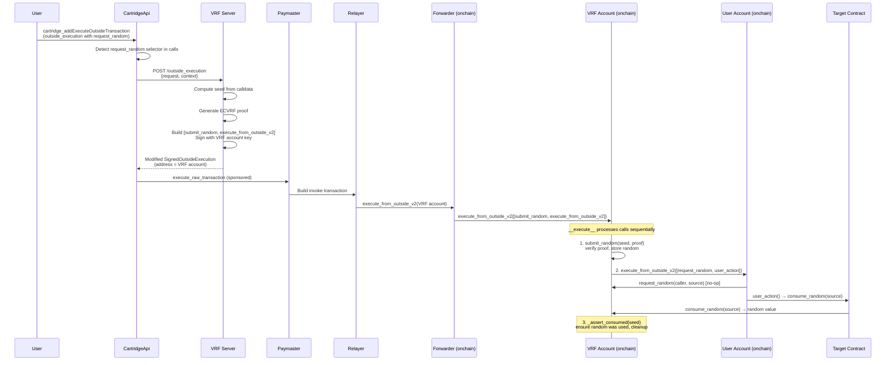

# VRF (Verifiable Random Function)

Katana integrates a Verifiable Random Function (VRF) service to provide provably fair, unpredictable randomness for onchain applications. The implementation uses ECVRF on the Stark curve with Poseidon hashing, delivering atomic execution where the random value is generated, verified, and consumed within a single transaction. This prevents front-running and ensures that callers cannot predict or manipulate outcomes.

Key properties:

- **Atomic execution** -- request, proof verification, and consumption happen in one transaction
- **Efficient onchain verification** -- uses Stark curve and Poseidon hash, native to Starknet
- **Fully onchain** -- the entire VRF process is transparent and verifiable
- **SRC9 outside execution** -- uses nested `execute_from_outside_v2` calls ([SNIP-9](https://github.com/starknet-io/SNIPs/blob/main/SNIPS/snip-9.md)); both the VRF account and the user's account must implement SRC9

The VRF server source is at [cartridge-gg/vrf](https://github.com/cartridge-gg/vrf/tree/6d1c0f60a53558f19618b2bff81c3da0849db270), pinned in `sidecar-versions.toml`. The underlying cryptographic library is [dojoengine/stark-vrf](https://github.com/dojoengine/stark-vrf).

## Architecture

The VRF integration relies on the following components working together:

| Component | Location | Role |
|-----------|----------|------|
| **VRF Server** | Sidecar process (default port 3000) | Generates ECVRF proofs, wraps user transactions with `submit_random` + `execute_from_outside` |
| **Cairo Contracts** | Onchain (`VrfAccountComponent`) | Verifies proofs, stores random values, manages nonces and consumption |
| **Cartridge JSON-RPC API** | `CartridgeApi` in `katana-rpc-server` | Detects `request_random` calls in outside executions, routes to VRF server |
| **Paymaster + Forwarder** | Paymaster sidecar + onchain Forwarder contract | Sponsors gas fees; the Relayer account submits the final transaction through the Forwarder |

### Why the paymaster is required

The VRF flow uses the outside execution pattern (SNIP-9): the user signs an off-chain message rather than submitting an onchain transaction directly. This means someone else must wrap that signed message into an actual invoke transaction, submit it to the network, and pay for gas. The paymaster fills this role:

- The paymaster's **Relayer** account is the `sender_address` of the invoke transaction -- it pays the execution fees.
- The paymaster's **Forwarder** contract is the onchain entry point that routes the nested `execute_from_outside_v2` calls to the VRF account and then to the user's account.

Without the paymaster, there is no mechanism to submit the transaction or sponsor gas. The VRF server only produces proofs and rewrites the call sequence -- it does not submit transactions itself.

```mermaid
flowchart LR
    User["User / Client"]
    RPC["CartridgeApi\n(RPC Middleware)"]
    VRF["VRF Server\n(Sidecar)"]
    PM["Paymaster"]
    Relayer["Relayer Account"]
    Forwarder["Forwarder\n(Onchain)"]
    VrfAcct["VRF Account\n(Onchain)"]
    UserAcct["User Account\n(Onchain, SRC9)"]
    Target["Target Contract"]

    User -->|"outside execution\n(with request_random)"| RPC
    RPC -->|"POST /outside_execution"| VRF
    VRF -->|"proof + wrapped tx"| RPC
    RPC -->|"sponsored tx"| PM
    PM -->|"invoke tx"| Relayer
    Relayer -->|"execute_from_outside_v2"| Forwarder
    Forwarder -->|"execute_from_outside_v2\n[submit_random, execute_from_outside_v2]"| VrfAcct
    VrfAcct -->|"execute_from_outside_v2\n[request_random, user_action]"| UserAcct
    UserAcct -->|"consume_random"| Target
```



## Transaction flow

The following sequence shows how a VRF-enabled transaction is processed end-to-end:



### Nested outside execution

The VRF flow relies on **nested `execute_from_outside_v2` calls** (SNIP-9 / SRC9):

```
Relayer → Forwarder.execute_from_outside_v2(
    VrfAccount.execute_from_outside_v2([
        submit_random(seed, proof),
        UserAccount.execute_from_outside_v2([
            request_random(caller, source),
            user_action(...)
        ])
    ])
)
```

This means the **user's account must implement SRC9** (`execute_from_outside_v2`). Standard accounts that only implement SRC6 will fail with `ENTRYPOINT_NOT_FOUND`. See [dojoengine/katana#517](https://github.com/dojoengine/katana/issues/517) for the related issue about upgrading dev genesis accounts.

The VRF account's `__execute__` processes calls sequentially. When it encounters a `submit_random` call, it records the seed. After all calls complete, it automatically calls `_assert_consumed` to ensure the random value was actually consumed and then clears the stored value.

## Bootstrap

When `--vrf` is enabled, Katana deterministically bootstraps the VRF infrastructure using a prefunded dev account:

1. Derive VRF account credentials from a fixed secret key
2. Compute deterministic address using UDC with `unique=false`
3. Declare `CartridgeVrfAccount` class (if not already declared)
4. Deploy VRF account via UDC
5. Fund VRF account with 1 STRK from the prefunded dev account
6. Set VRF public key on the deployed account (`set_vrf_public_key`)
7. Declare and deploy `CartridgeVrfConsumer` with VRF account as constructor arg
8. Start VRF server sidecar process with the derived credentials

| Constant | Value | Purpose |
|----------|-------|---------|
| `VRF_HARDCODED_SECRET_KEY` | `0x111` | ECVRF secret key for key pair derivation |
| `VRF_ACCOUNT_SALT` | `0x54321` | UDC deployment salt for VRF account |
| `VRF_CONSUMER_SALT` | `0x67890` | UDC deployment salt for VRF consumer |
| `BOOTSTRAP_TIMEOUT` | 10s | Max wait time per bootstrap step |
| Funding amount | 1 STRK (10^18 wei) | Initial VRF account balance |

> Source: `crates/cartridge/src/vrf/server/bootstrap.rs`

## VRF server endpoints

The VRF server is an Axum HTTP server. Source: [server/src/routes](https://github.com/cartridge-gg/vrf/tree/6d1c0f60a53558f19618b2bff81c3da0849db270/server/src/routes).

| Method | Path | Description |
|--------|------|-------------|
| `GET` | `/` | Health check. Returns `"OK"`. |
| `GET` | `/info` | Returns the VRF public key. |
| `POST` | `/proof` | Generates an ECVRF proof for a given seed. |
| `POST` | `/outside_execution` | Main endpoint: wraps a user's outside execution with VRF proof. |

### `GET /info`

Returns the server's ECVRF public key as hex-encoded Stark curve point coordinates.

**Response:**
```json
{
  "public_key_x": "0x...",
  "public_key_y": "0x..."
}
```

### `POST /proof`

Generates an ECVRF proof for the provided seed values.

**Request:**
```json
{
  "seed": ["0x..."]
}
```

**Response:**
```json
{
  "result": {
    "gamma_x": "0x...",
    "gamma_y": "0x...",
    "c": "0x...",
    "s": "0x...",
    "sqrt_ratio": "0x...",
    "rnd": "0x..."
  }
}
```

### `POST /outside_execution`

The primary endpoint used by Katana. Receives a user's signed outside execution that contains a `request_random` call, computes the VRF proof, and returns a modified execution where the VRF account is the executor.

**Request:**
```json
{
  "request": {
    "address": "0x...",
    "outside_execution": { "V2": { ... } },
    "signature": ["0x...", "0x..."]
  },
  "context": {
    "chain_id": "KATANA",
    "rpc_url": "http://127.0.0.1:5050"
  }
}
```

**Response:**
```json
{
  "result": {
    "address": "0x...",
    "outside_execution": { "V2": { ... } },
    "signature": ["0x...", "0x..."]
  }
}
```

The returned `address` is the VRF account (not the user), and the `outside_execution.calls` are rewritten to `[submit_random, execute_from_outside_v2]`.

**Processing flow** ([source](https://github.com/cartridge-gg/vrf/blob/6d1c0f60a53558f19618b2bff81c3da0849db270/server/src/routes/outside_execution/mod.rs)):

1. Locate `request_random` call in the user's outside execution
2. Extract seed parameters from `request_random` calldata
3. Compute the deterministic seed (matching onchain computation)
4. Generate ECVRF proof for the seed
5. Build a new call sequence: `submit_random(seed, proof)` then `execute_from_outside(user_execution, signature)`
6. Sign the modified execution with the VRF account's private key
7. Return the signed execution with the VRF account as the new executor

## Cairo contracts

### SRC9 requirement for user accounts

Because the VRF flow uses nested `execute_from_outside_v2` calls, **any account that participates as a user must implement the SRC9 interface**. Accounts that only implement the base SRC6 account interface (like the legacy OpenZeppelin account used in Katana's dev genesis) will fail with `ENTRYPOINT_NOT_FOUND` when the VRF account tries to call `execute_from_outside_v2` on them. See [dojoengine/katana#517](https://github.com/dojoengine/katana/issues/517).

### VRF Account (`IVrfAccount`)

The VRF account contract combines a standard Starknet account with VRF provider functionality and SRC9 outside execution support. Source: `crates/contracts/contracts/vrf/src/vrf_account/vrf_account_component.cairo`.

| Function | Mutability | Description |
|----------|-----------|-------------|
| `request_random(caller, source)` | view | No-op marker; signals intent to consume randomness |
| `submit_random(seed, proof)` | write | Verifies ECVRF proof onchain, stores random value keyed by seed |
| `consume_random(source)` | write | Returns `Poseidon(random, consume_count)`, increments count |
| `get_consume_count()` | view | Current consumption count within the transaction |
| `is_vrf_call()` | view | Whether `submit_random` has been called in current tx |
| `get_vrf_public_key()` | view | Returns `PublicKey { x, y }` |
| `set_vrf_public_key(pubkey)` | write | Self-only; sets the ECVRF public key |

### VRF Provider (`IVrfProvider`)

A standalone component variant of the VRF logic, usable outside the account context. Source: `crates/contracts/contracts/vrf/src/vrf_provider/vrf_provider_component.cairo`, [upstream](https://github.com/cartridge-gg/vrf/blob/6d1c0f60a53558f19618b2bff81c3da0849db270/src/vrf_provider/vrf_provider_component.cairo).

Same interface as VRF Account but uses `get_public_key` / `set_public_key` (owner-only via `OwnableComponent`) and includes an explicit `assert_consumed(seed)` function.

### Source types

Defined in `crates/contracts/contracts/vrf/src/types.cairo` ([upstream](https://github.com/cartridge-gg/vrf/blob/6d1c0f60a53558f19618b2bff81c3da0849db270/src/types.cairo)):

```cairo
pub enum Source {
    Nonce: ContractAddress,  // Auto-incrementing per-address nonce
    Salt: felt252,           // User-provided salt for deterministic seeds
}

pub struct PublicKey {
    pub x: felt252,
    pub y: felt252,
}
```

**Seed computation** varies by source type:

- `Source::Nonce(addr)`: `seed = Poseidon(nonce, addr, caller, chain_id)` -- nonce auto-increments on first `consume_random` per transaction, ensuring unique seeds across calls
- `Source::Salt(salt)`: `seed = Poseidon(salt, caller, chain_id)` -- same salt produces same seed (deterministic)

### Security mechanisms

- **Fee estimation protection**: During simulation (all resource bounds = 0), `consume_random` returns `0` to prevent leaking the random value before the actual transaction
- **Consumption enforcement**: `_assert_consumed` is called automatically at the end of `__execute__` when a `submit_random` call is present; it reverts if `consume_count == 0`
- **Storage cleanup**: After assertion, the stored random value is zeroed out and the consume count is reset to `None`

## Cryptographic details

The VRF uses an Elliptic Curve VRF (ECVRF) construction on the **Stark curve** with **Poseidon hashing**. The implementation is provided by the [`stark-vrf`](https://github.com/dojoengine/stark-vrf) crate.

### Key generation

The secret key is a scalar value (provided as `u64`). The public key is a point on the Stark curve:

```
public_key = secret_key * G
```

where `G` is the Stark curve generator point. The public key coordinates `(x, y)` are stored onchain in the `PublicKey` struct.

### Proof generation (off-chain, by VRF server)

Given a seed (array of field elements):

1. **Hash to curve**: `H = hash_to_curve(public_key, seed)` using the Simplified SWU (Shallue-van de Woestijne-Ulas) mapping
2. **Compute gamma**: `gamma = secret_key * H`
3. **Pick nonce**: deterministic nonce `k` derived from secret key and input
4. **Compute commitments**: `U = k * G`, `V = k * H`
5. **Challenge**: `c = Poseidon(public_key, H, gamma, U, V)`
6. **Response**: `s = k + c * secret_key`
7. **Output**: `rnd = Poseidon(gamma_x, gamma_y)`

### Proof verification (onchain, by Cairo contract)

The Cairo contract ([source](https://github.com/cartridge-gg/vrf/blob/6d1c0f60a53558f19618b2bff81c3da0849db270/src/vrf_provider/vrf_provider_component.cairo)) verifies proofs using `ECVRFImpl::verify()` from the [`stark_vrf`](https://github.com/dojoengine/stark-vrf) Cairo package:

1. Recompute `H = hash_to_curve(public_key, seed)`
2. Recompute `U = s * G - c * public_key`
3. Recompute `V = s * H - c * gamma`
4. Recompute `c' = Poseidon(public_key, H, gamma, U, V)`
5. Assert `c == c'`
6. Return `beta = Poseidon(gamma_x, gamma_y)` as the verified random output

The `sqrt_ratio` field in the proof is a computation hint that allows the onchain verifier to avoid expensive square root operations during point decompression.

### Proof components

| Field | Type | Description |
|-------|------|-------------|
| `gamma_x` | felt252 | X-coordinate of VRF output point on Stark curve |
| `gamma_y` | felt252 | Y-coordinate of VRF output point on Stark curve |
| `c` | felt252 | Schnorr-like challenge value |
| `s` | felt252 | Schnorr-like response scalar |
| `sqrt_ratio` | felt252 | Hint for efficient onchain square root computation |
| `rnd` | felt252 | `Poseidon(gamma_x, gamma_y)` -- the random output |

## Configuration

### Katana CLI flags

| Flag | Type | Default | Description |
|------|------|---------|-------------|
| `--vrf` | bool | `false` | Enable VRF service (requires `--paymaster.cartridge`) |
| `--vrf.url` | URL | -- | Connect to an external VRF service instead of spawning a sidecar |
| `--vrf.contract` | address | -- | VRF account contract address (required with `--vrf.url`) |
| `--vrf.bin` | path | `vrf-server` | Path to VRF sidecar binary |

When `--vrf.url` is not provided, Katana runs the VRF server as a sidecar process. The sidecar binary is resolved in order: explicit `--vrf.bin` path, `$PATH` lookup, `~/.katana/bin/`, or automatic download from the GitHub release matching the version in `sidecar-versions.toml`.

> Source: `crates/cli/src/options.rs`

### VRF server CLI args (sidecar)

| Arg | Default | Description |
|-----|---------|-------------|
| `--host` | `0.0.0.0` | HTTP bind address |
| `--port` / `-p` | `3000` | HTTP listen port |
| `--account-address` | -- | VRF account contract address (hex) |
| `--account-private-key` | -- | VRF account signing key (hex) |
| `--secret-key` / `-s` | -- | ECVRF secret key (u64) |

> Source: [server/src/main.rs](https://github.com/cartridge-gg/vrf/blob/6d1c0f60a53558f19618b2bff81c3da0849db270/server/src/main.rs)

### Modes of operation

- **Sidecar mode** (default when `--vrf` is set without `--vrf.url`): Katana bootstraps the VRF infrastructure (declares and deploys the VRF account and consumer contracts, funds the account, sets the public key), then spawns the `vrf-server` binary as a child process with the derived credentials.
- **External mode** (`--vrf.url` provided): Katana connects to an already-running VRF service at the given URL. No bootstrap or sidecar is spawned. The `--vrf.contract` flag must also be provided to specify the VRF account address. The external service and its onchain contracts must be fully deployed and configured independently.

See [docs/cartridge.md](cartridge.md#modes-of-operation) for a detailed comparison of sidecar vs external mode across both services.
